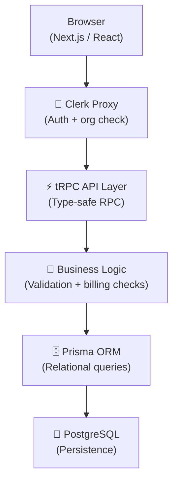
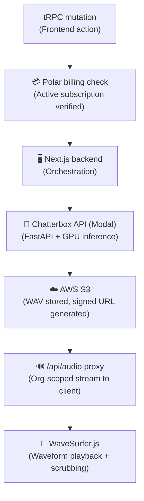
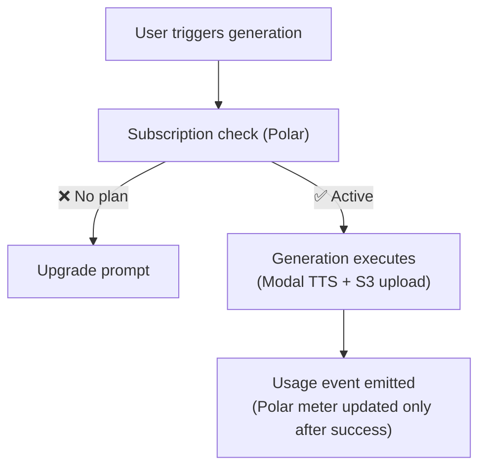
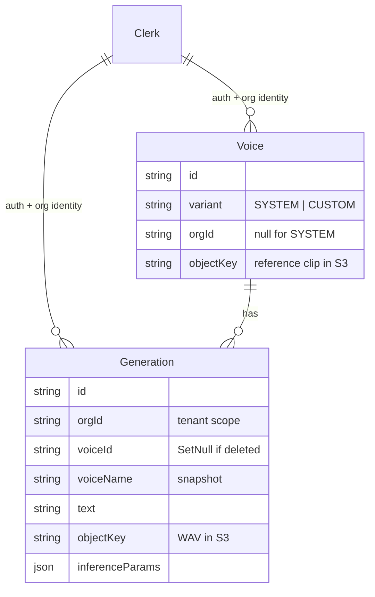
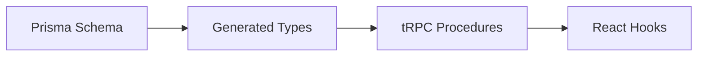

<div align="center">
 
  <h1>🎙️ Resona</h1>
  <p><strong>Full-stack AI voice generation platform with self-hosted inference, multi-tenant organization workspaces, metered subscription billing, and private media delivery.</strong></p>


  <div>
    <a href="https://nextjs.org/"></a>
    <a href="https://react.dev/"></a>
    <a href="https://www.typescriptlang.org/"></a>
    <a href="https://tailwindcss.com/"></a>
    <a href="https://www.prisma.io/"></a>
    <a href="https://www.postgresql.org/"></a>
    <a href="https://trpc.io/"></a>
    <a href="https://clerk.com/"></a>
    <a href="https://aws.amazon.com/s3/"></a>
    <a href="https://fastapi.tiangolo.com/"></a>
    <a href="https://sentry.io/"></a>
    <a href="https://vercel.com/"></a>
  </div>
</div>

<br />

## 📸 Quick Demo

<div align="center">
  <video src="public/resona/resona.mp4" width="800" controls autoplay loop muted style="border-radius: 8px; margin-bottom: 16px;"></video>
  <br />
  <p>
    <a href="https://resonapro.vercel.app"></a>
    <a href="https://resonapro.vercel.app/learnings"></a>
    <a href="https://youtu.be/Bt2X_5rsFO0"></a>
  </p>
</div>

<br />

## 📖 Table of Contents

- [Overview](#-overview)
- [System Architecture](#%EF%B8%8F-system-architecture)
- [Voice Generation & Audio](#-voice-generation--audio)
- [Custom Voice Cloning](#-custom-voice-cloning)
- [Multi-Tenant Architecture](#-multi-tenant-architecture)
- [Billing Architecture](#-billing-architecture)
- [Database Schema](#%EF%B8%8F-database-schema)
- [Security Model](#%EF%B8%8F-security-model)
- [Tech Stack](#%EF%B8%8F-tech-stack)
- [Deployment & Operations](#-deployment--operations)
- [Key Engineering Learnings](#-key-engineering-learnings)

---

## 🌟 Overview

Resona is a full-stack AI voice generation platform built for scale. It combines self-hosted inference with robust multi-tenant capabilities, metered billing, and secure media delivery.

| Capability | Description |
| :--- | :--- |
| 🎤 **Speech Generation** | Text-to-speech via self-hosted Chatterbox TTS on Modal |
| 🧬 **Voice Cloning** | Upload or record custom voices, scoped per organization |
| 🏢 **Multi-Tenancy** | Org-isolated workspaces with Clerk-backed Next.js Proxy enforcement |
| 💳 **Metered Billing** | Polar SDK subscriptions with post-success usage event emission |
| ☁️ **Secure Storage** | Private S3 buckets, opaque object keys, and authenticated app proxies |
| 🔭 **Observability** | Sentry error tracking with structured logs on critical paths |

---

## 🏗️ System Architecture

### Web Application Flow



### Voice Generation Pipeline



### 🌍 Deployment Topology

| Service | Host |
| :--- | :--- |
| 🖥️ **Frontend / API** | **Vercel** — Next.js app, API routes, tRPC |
| 🤖 **Inference** | **Modal** — Chatterbox TTS (FastAPI, GPU) |
| 🐘 **Database** | **PostgreSQL** |
| ☁️ **Object Storage** | **AWS S3** — signed URLs, app-proxied delivery |
| 🔐 **Auth** | **Clerk** — users, organizations, sessions |
| 💳 **Billing** | **Polar SDK** — subscriptions, metered usage |
| 🔭 **Monitoring** | **Sentry** — errors, session replay |

### 🧱 Architectural Boundaries

| Boundary | Responsibility |
| :--- | :--- |
| **Frontend** | Next.js App Router pages, React Server Components where possible, client components for waveform, recording, forms, and dashboard interactions |
| **API Layer** | tRPC routers for product mutations/queries; route handlers for binary upload and audio streaming |
| **Auth Layer** | Clerk sessions and organizations; Proxy guards page routes while API/tRPC handlers enforce auth again server-side |
| **Data Layer** | Prisma models for voices and generations only; Clerk and Polar remain external systems of record |
| **Billing Layer** | Polar checkout, portal sessions, subscription checks, and post-success usage events keyed by Clerk org ID |
| **Storage Layer** | AWS S3 stores system voices, custom voice references, and generated WAVs behind application-controlled access |
| **Inference Layer** | Modal-hosted FastAPI service wraps Chatterbox TTS and reads voice reference audio from the S3 bucket mount |
| **Observability** | Sentry captures errors and request context on critical API/tRPC paths |

---

## 🎙️ Voice Generation & Audio

Self-hosted Chatterbox TTS inference running on Modal (FastAPI + GPU). No third-party voice API dependency.

- **Infrastructure Control**: Self-hosted inference shifts generation cost and reliability concerns into owned infrastructure.
- **Real-Time Configuration**: Real-time text-to-speech with configurable parameters (temperature, topP, topK).
- **Interactive UI**: WaveSurfer.js waveform rendering with scrubbing, seeking, and progressive streaming. Desktop and mobile audio players with download support.
- **Secure Delivery**: Signed URL delivery ensures S3 buckets stay private and browsers never see raw object keys.

### Generation Flow

1. The dashboard submits text, voice ID, and inference parameters through `generations.create`.
2. The tRPC procedure verifies an active Polar subscription for the current Clerk organization.
3. The selected voice must be either a global `SYSTEM` voice or a `CUSTOM` voice owned by the same organization.
4. The Next.js API calls the Modal/FastAPI Chatterbox endpoint and receives WAV bytes.
5. A `Generation` row is created, the WAV is uploaded to S3, and the row is updated with the S3 object key.
6. If storage or the final DB update fails, the newly created row is deleted so the UI does not show broken audio.
7. Polar usage is emitted only after successful storage using event `tts_generation` with metadata `{ characters }`.
8. Playback goes through `/api/audio/:generationId`, which re-checks organization ownership before streaming audio.

---

## 🧬 Custom Voice Cloning

Org-scoped custom voice creation with upload and in-browser recording.

| Workflow | Details |
| :--- | :--- |
| 📤 **Upload** | MIME type + duration + file-size (~20MB) validation, client + server |
| 🎙️ **Record** | In-browser via RecordRTC with preview before upload |
| 🎨 **Avatars** | Auto-generated via DiceBear |
| 🔍 **Search** | Debounced queries with Nuqs URL state |
| 🗑️ **Delete** | Cascade-safe — `SetNull` on generation foreign keys |

### Voice Cloning Flow

1. Client uploads raw audio bytes to `/api/voices/create` with validated metadata in query params.
2. Route checks Clerk auth, active organization, and Polar subscription before reading the body.
3. Server validates file presence, size, content type, parseable audio metadata, and minimum duration.
4. A `CUSTOM` voice row is created without an object key, then the audio is uploaded to S3.
5. Row is updated with `voices/orgs/:orgId/:voiceId`; failures roll back the initial DB insert.
6. Polar usage is emitted only after durable storage using event `voice_creation`.
7. Previews go through `/api/voices/:voiceId`; `SYSTEM` voices are globally readable after auth, while `CUSTOM` voices require org ownership.

---

## 🏢 Multi-Tenant Architecture

Organization isolation is enforced at the database, routing, and Proxy/procedure layers.

- **Proxy Enforcement**: Clerk-backed Proxy enforces auth + org selection for protected page routes.
- **Server Guards**: API routes and tRPC procedures enforce their own server-side guards.
- **Scoped Queries**: Every tRPC procedure receives `ctx.orgId` — all queries filter by it.
- **Session Integrity**: Org switching updates session context; no stale state reuse.
- **Data Privacy**: Voices and generations are only visible inside the owning organization.

```typescript
// orgProcedure attaches ctx.orgId from Clerk on every tenant mutation.
const generation = await prisma.generation.findUnique({
  where: { id: input.id, orgId: ctx.orgId },
});

const voice = await prisma.voice.findUnique({
  where: {
    id: input.voiceId,
    OR: [
      { variant: "SYSTEM" },
      { variant: "CUSTOM", orgId: ctx.orgId },
    ],
  },
});
```

---

## 💳 Billing Architecture

Polar SDK handles subscriptions and metered usage. Billing enforcement is server-side in tRPC procedures — not frontend-only.



**Protected premium actions:** AI speech generation, custom voice creation, voice cloning uploads, org-wide voice sharing — all gated server-side.

> **Note:** Usage events emit **after** S3 upload confirmation, not before. Failed generations never increment the meter.

### Polar Contract

Polar uses the Clerk organization ID as `externalCustomerId`. That is the multi-tenant billing boundary: subscriptions, portal sessions, and usage events all attach to the organization rather than an individual user.

| Product Surface | Code Event | Meter Semantics |
| :--- | :--- | :--- |
| **Text-to-speech** | `tts_generation` | Sum metadata property `characters` |
| **Custom voice creation** | `voice_creation` | Count successful events |

`billing.getStatus` reads Polar customer state at request time and sums active subscription meter amounts for the dashboard estimate. There is no local subscription cache or webhook mirror in Postgres.

---

## 🗄️ Database Schema

The database schema is intentionally small. Each entity owns a single concern, and org scope is the default.



Generations reference voices. Clerk carries org identity. Polar handles subscription state outside Postgres.

---

## 🛡️ Security Model

Layered controls across routing, storage, validation, and billing enforcement.

| Layer | Mechanism |
| :--- | :--- |
| 🏢 **Tenant Isolation** | All queries filter by `ctx.orgId`. No cross-org data leakage. |
| 🔐 **Signed URLs** | Private S3 buckets. Time-limited URLs expire after a short window. |
| 🚧 **Route Protection** | Clerk-backed Proxy guards pages; API/tRPC handlers validate auth server-side. |
| 📏 **Upload Validation** | MIME type, file size (~20MB), audio duration — server is authoritative. |
| 💳 **Premium Enforcement**| tRPC procedures enforce billing. Bypassing UI doesn't bypass policy. |
| 🔭 **Error Monitoring** | Sentry captures errors and structured logs from critical request paths. |
| 🔑 **Secrets** | Environment-scoped and validated at startup. No hardcoded credentials. |

---

## ⚙️ Tech Stack

### Frontend
- **Next.js 16** (App Router, React Server Components)
- **React 19**
- **Tailwind CSS v4** & **ShadCN UI**
- **TanStack React Form** & **Nuqs** (URL state)
- **WaveSurfer.js**, **RecordRTC**, **React Dropzone**, **DiceBear**

### Backend
- **tRPC** (End-to-end type-safe API)
- **Prisma ORM** & **PostgreSQL**
- **OpenAPI TS** (Generated client types)
- **FastAPI** (Chatterbox TTS inference on Modal)
- **AWS S3** (`@aws-sdk/client-s3`)

### 🧠 Type Safety Pipeline



*Compile-time safety across the entire stack.*

---

## ☁️ Storage

| Aspect | Implementation |
| :--- | :--- |
| 📦 **Provider** | AWS S3 via `@aws-sdk/client-s3` |
| 🔐 **Access** | Private buckets + time-limited signed URLs |
| 🔀 **Delivery** | App proxies (`/api/audio/:id`, `/api/voices/:id`) — browsers never see raw keys |
| 🧭 **Key Shape** | `voices/system/:id.wav`, `voices/orgs/:orgId/:voiceId`, `generations/orgs/:orgId/:generationId` |

The Next.js app owns writes to S3. Modal mounts the same bucket read-only at `/storage`, so inference can resolve `voice_key` values as local files without receiving S3 credentials from each request.

Deletes are best-effort after the database record is removed. If strict storage hygiene becomes required, add a reconciliation job that compares live object keys against Prisma rows.

---

## 📊 Observability & Performance

**Observability:**
- Sentry was configured before the first deployment.
- Captures `orgId` on guarded generation/billing paths, `voiceId`, voice variant, text length, generation params.
- Session replay, structured logging, and context-aware debugging included.

**Performance:**
- **React Server Components** reduce client JS by fetching server-side.
- **Loading skeletons** prevent layout shift during async operations.
- **Debounced search** prevents tRPC queries on every keystroke.
- **Nuqs URL state** keeps filters in the URL with no component-level sync overhead.
- **Streamed audio** via WaveSurfer.js progressively streams without full-file preloading.

---

## 🔧 Engineering Learnings & Challenges

<details>
<summary>🔄 <strong>Prisma connection exhaustion in development</strong></summary>
Next.js hot reload recreates module instances on every save, spawning new Prisma clients and connection pools. Fixed with a process-level singleton.
</details>

<details>
<summary>📂 <strong>Next.js route groups and layout confusion</strong></summary>
Route groups affect layout organization, not URL structure. Misplacing them attaches authenticated layouts to public routes. Fix: treat route groups as structure only, keep access control in `proxy.ts` and server handlers.
</details>

<details>
<summary>⏱️ <strong>Signed URL expiry during playback</strong></summary>
Signed URLs have a limited TTL. If playback starts near expiry, the URL becomes invalid mid-session. Fix: generate fresh URLs at playback time.
</details>

<details>
<summary>🎙️ <strong>Browser recording compatibility</strong></summary>
<code>MediaRecorder</code> MIME type and blob behavior differs across browsers. RecordRTC abstracts most variance, but upload handling still needs MIME normalization for consistent server-side processing.
</details>

<details>
<summary>💰 <strong>Metered billing accuracy</strong></summary>
Usage events emit only after S3 upload confirmation. If generation fails, the meter doesn't increment — billing stays aligned with actual output.
</details>

### Key Learnings

1. **Owning inference changes the operating model**: Self-hosting moves generation cost, reliability, and model behavior into infrastructure the product controls.
2. **Multi-tenancy must be foundational**: Retrofitting tenant isolation is painful. Orgs must be a first-class DB, routing, and server-guard concern from day one.
3. **Type safety is a productivity multiplier**: tRPC + Prisma + TypeScript means schema changes propagate visibly through the entire stack at compile time.
4. **Billing is architecture, not UI**: Feature gates and usage metering belong in the application layer. Frontend-only gates are decoration, not policy.
5. **Observability before production**: Sentry was set up before the first deployment, with structured logs around generation and billing paths.
6. **Signed URLs are the correct default**: Public buckets are wrong for user-generated content. Time-limited signed URLs give controlled access without risk.

---

## 🚢 Deployment & Operations

### Operational Workflows

| Workflow | Command / Location | Why It Matters |
| :--- | :--- | :--- |
| **Generate Prisma client** | `prisma generate` | Keeps Prisma client in sync with schema changes |
| **Sync inference types** | `npm run sync-api` | Regenerates TS client from Modal/FastAPI OpenAPI spec |
| **Seed system voices** | `npx prisma db seed` | Uploads bundled WAV presets and upserts `SYSTEM` voice rows |
| **Deploy inference** | `python -m modal deploy ...`| Publishes the Chatterbox FastAPI service |
| **Configure storage** | Modal secret `aws-storage` | Lets Modal read the same bucket the app writes to |

The Modal class is configured with `scaledown_window=120`, so inactive inference workers may scale down. The app treats inference as a network boundary that can fail, cold start, or return invalid audio.

---

## 🔮 Future Improvements

- **Background job queue**: Move inference out of the HTTP request lifecycle, remove timeout pressure.
- **Redis caching**: Cut repeated org/subscription lookups on authenticated requests.
- **Webhook retry strategy**: Prevent billing state drift when provider events arrive late.
- **Granular RBAC**: Separate member/admin powers without widening the auth model.
- **Usage analytics**: Give organizations visibility into consumption patterns.
- **Rate limiting per org**: Safety valve against runaway usage and accidental abuse.
- **API key system**: Let external developers access the inference pipeline directly.
- **Distributed workers**: Scale Modal/Chatterbox workers horizontally.
